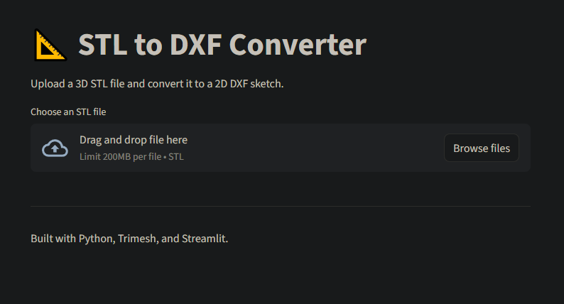

# 📐 STL to DXF Converter

[](https://stl-to-dxf-converter.streamlit.app/)
[](https://www.python.org/)

A simple, open-source web application to convert 3D **STL** files into 2D **DXF** sketches.  
Ideal for generating laser cutting profiles, CNC paths, or floor plans from 3D models.



## ✨ Features
- **Interactive 3D Viewer**: Visualize the model (green) and the cut path (red) in real-time.
- **Precise Slicing**: Use the slider to pick the exact height/position of the cut.
- **Easy to Use**: Drag and drop your `.stl` file.
- **Auto-Slicing**: Automatically slices the mesh at its center (default).
- **Axis Selection**: Choose to slice along the X, Y, or Z axis.
- **Instant Preview**: Shows mesh statistics and bounding box.
- **Cross-Platform**: Runs in your browser, works on Windows, Mac, and Linux.

> [!NOTE] 
> This tool is designed for **uniform extrusions** (prismatic shapes). It works by slicing the mesh through the center. Irregular, tapered, or organic shapes may not yield a valid 2D sketch.

## 🚀 How to Run Locally

You can run this app on your own machine using Python.

1.  **Clone the repository:**
    ```bash
    git clone https://github.com/evanofficial/stl-to-dxf-converter.git
    cd stl-to-dxf-converter
    ```

2.  **Install dependencies:**
    ```bash
    pip install -r requirements.txt
    ```

3.  **Run the app:**
    ```bash
    streamlit run app.py
    ```

The app will open automatically in your web browser at `http://localhost:8501`.

## 🛠️ Built With
- **[Streamlit](https://streamlit.io/)** - For the web interface.
- **[Trimesh](https://trimesh.org/)** - For loading and slicing 3D meshes.
- **[Plotly](https://plotly.com/python/)** - For interactive 3D visualization.
- **[Ezdxf](https://ezdxf.mozman.at/)** - For creating valid DXF files.
- **[NumPy](https://numpy.org/)** - For high-performance vector math.

## 📄 License
This project is open source and available under the [MIT License](LICENSE).
